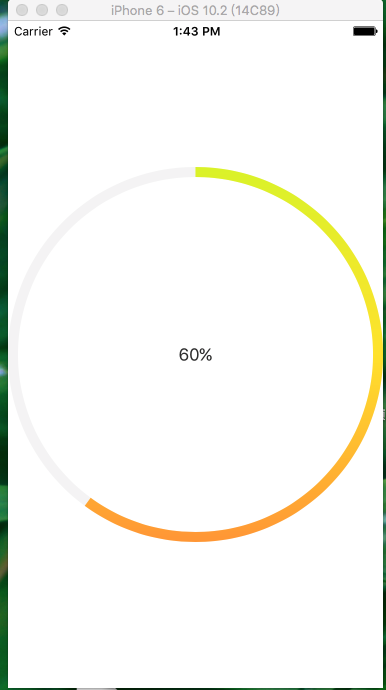

## 环形渐变进度条
引入#import "BezierPathView.h"头文件
直接初始化创建就行了

>  BezierPathView *bezierV = [[BezierPathView alloc] init];
    bezierV.frame = CGRectMake(0, 0, self.view.frame.size.width, self.view.frame.size.height);
    //设置环形比例
    bezierV.progress = 0.6;
    //设置动画时间
    bezierV.time = 2;
    //设置环形底层颜色
    bezierV.backLayerColor = @"#f5f5f5";
    //是否设置渐变色
    bezierV.isMoreColor = YES;
    //如果不设置渐变色 进度条颜色取第一个
    bezierV.colorArray = @[@"#C4FF2B",@"#FFE632",@"#FF6B44"];
    
    [self.view addSubview:bezierV];

